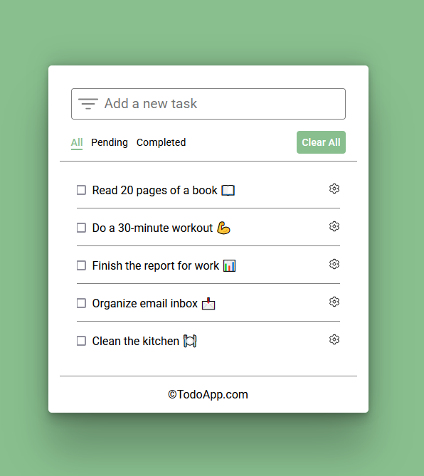

# Simple Todo app using Flask

Simple Flask todo app using Flask, Pymongo and Mongodb database.



## I. Setup
#### Create a project:

```
mkdir project
cd project
git clone https://github.com/brtkee/Flask-Todo-app.git .
python -m venv env
```

#### Activate virtual environment in terminal:
on Unix/Linux: 
```
. env/bin/activate
```
on Windows:
```
env\Scripts\activate
```

#### Install all needed dependencies:
```
pip install -r requirements.txt
```

#### Environment variables:
Create .env file with following variables:
```
DEBUG_MODE = False # Set to True for development.
DB_PASSWORD = 'your_mongodb_password'
```

## II. Run app
```
python app/main.py
```
